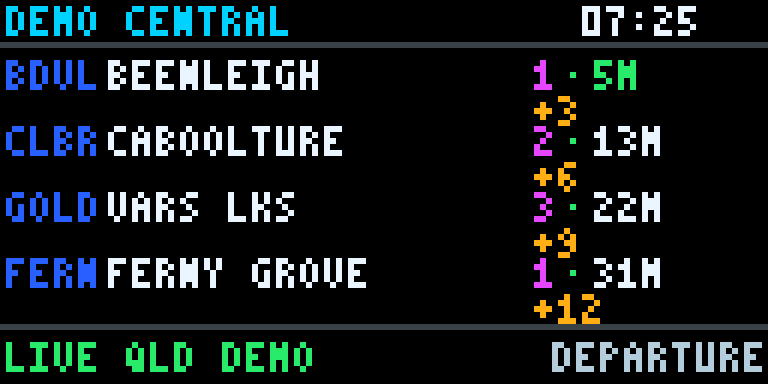
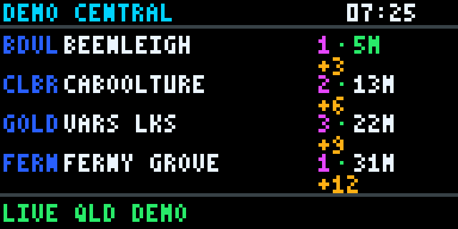
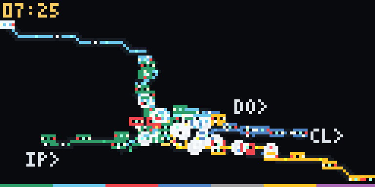
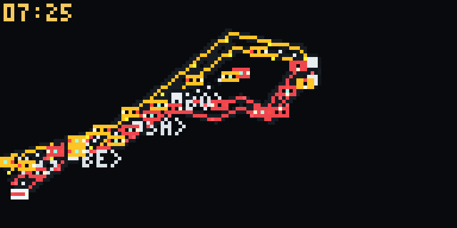
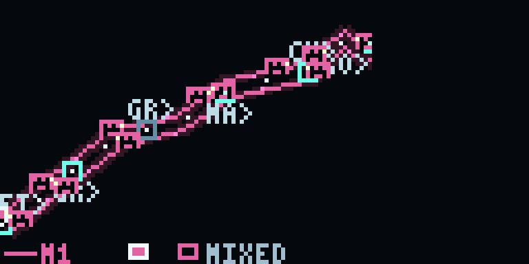

# Queensland Train Tracker

> A native 128×64 Queensland public-transport display engine for departures, a connected SEQ rail system schematic, focused rail corridors, and Brisbane Metro/busway operations.

[](https://github.com/lachlanthwaite6/Train-Tracker/actions/workflows/ci.yml)




Queensland Train Tracker lets you design, simulate, test, and record public-transport displays on a laptop before connecting a Raspberry Pi and HUB75 panel. It operates offline with imported static GTFS, optionally consumes GTFS-Realtime, and makes physically observed GPS positions visually distinct from timetable-derived movement.

**This is an independent open-source project. It is not official Translink software, is not endorsed by Translink or the Queensland Government, and does not use their logos or map artwork.**

## Display views

| Screen | Best for |
| --- | --- |
| Departure Board | Upcoming services, platforms and delays |
| Rail System View | Seeing trains across the connected SEQ network |
| Rail Route Focus | Watching individual trains between stations |
| Bus Map | Following Metro and selected busway services |

| Preview | Actual application recording |
| --- | --- |
| Departure Board |  |
| Rail System View |  |
| Rail Route Focus |  |
| Bus Map |  |

The desktop GUI switches among all three screens without restarting and shares one clock, provider refresh, and latest realtime snapshot.

## Project status

- Laptop simulation, native rendering, PNG export, and deterministic GIF recording: **implemented and tested**.
- Static GTFS import and offline schedule animation: **implemented and tested**.
- GTFS-Realtime parsing, freshness, fallback, trip delay, and VehiclePosition handling: **implemented with offline fixtures**.
- Live Translink network availability: **not asserted by automated tests and dependent on the upstream feed**.
- Raspberry Pi/HUB75 adapter: **implemented but not verified on the final physical board**.

## Features

- Exact 128×64 RGB framebuffer rendered directly with Pillow—never designed large and downscaled.
- Original bundled 3×5 pixel font and nearest-neighbour desktop preview.
- Three native tabs in one responsive Tkinter application, with System View and Route Focus inside Rail Map.
- Pause, resume, restart, single-step, and 1×/10×/60× simulated time.
- Route, direction, map-scope, label, live-marker, and scheduled-estimate controls.
- Neon night styling using GTFS route colours, luminous stops, parallel lanes/tracks, and restrained direction pulses.
- Compact directional 5×3 rail markers and 6×4 bus sprites with live, estimated, stale, dwelling, selected, and clustered states.
- Static GTFS import to indexed SQLite with service-calendar and after-midnight support.
- Optional GTFS-Realtime TripUpdates, VehiclePositions, and Alerts with bounded retries and last-known-good fallback.
- Deterministic replay files and offline failure scenarios.
- Native PNG export, GIF recording, optional RGBMatrixEmulator, and guarded HUB75 output.
- Network-free tests with bundled miniature rail, bus, and departure fixtures.

## Animated showcase

### Departure board


The recording advances the real simulator clock, showing countdown changes, multiple destinations, accumulated delays, a platform change, and a cancellation.

### Rail System View


System View is the default Rail Map scope. It derives passenger-readable visual lines, branches, station order, shared corridors, termini, and interchanges from imported GTFS. The resulting octilinear schematic deliberately changes geographic distance while preserving network topology and approximate direction. It fills the 128×64 canvas, offsets colours on shared corridors, samples minor stations, places major labels around collisions, and moves a selected train's three-line details into the least obstructive corner.

### Rail Route Focus


Route Focus retains the larger corridor presentation for inspecting one or two selected services. It separates directions, spaces displayed stops, and reserves its contextual information area only when a train is selected. Switch between System View and Route Focus from the toolbar without restarting.

### Bus map


The showcase resolves M1 from GTFS, displays both directions, animates multiple buses, includes a GTFS-matched demonstration GPS vehicle alongside timetable estimates, shows stop dwell, and cycles selected-bus information.

The GIFs are generated by `train-tracker record-demo` from the same renderers used by the application. Their source frames are logical 128×64 images enlarged to 768×384 using nearest-neighbour scaling.

## What the project can display

- Up to four upcoming departures with route, destination, platform, countdown, delay, cancellation, and realtime state.
- Healthy, stale, offline, alert, timetable-only, and no-service states.
- A fitted connected rail schematic with major SEQ corridors and branches derived from GTFS.
- A focused rail corridor containing one route or a related pair, inbound, outbound, or both.
- A selected Metro/busway route with parallel inbound/outbound lanes.
- Solid live-GPS vehicles, hollow/dithered scheduled estimates, dim stale vehicles, dwelling animation, and selected halos.
- Compact vehicle details: route, destination, previous/next stop, data source/age, and delay.

**Schedule-derived movement is an estimate, not a physical observation.**

## Quick start

Python 3.11 or newer is required. Tkinter ships with the standard macOS Python installers; Debian/Ubuntu users may need `python3-tk`.

```bash
git clone https://github.com/lachlanthwaite6/Train-Tracker.git
cd Train-Tracker

python3 -m venv venv
source venv/bin/activate
python -m pip install -e '.[dev]'

train-tracker gui --mode simulated
```

The first-run simulator works without internet or downloaded data. Its sample stations are explicitly labelled **Demo** and are not real service information.

## Three-screen GUI

Open a specific screen directly:

```bash
train-tracker gui --mode simulated --view departures
train-tracker gui --mode simulated --view map --map-scope system
train-tracker gui --mode simulated --view map --map-scope route
train-tracker gui --mode simulated --view bus-map --bus-route M1
```

The Rail Map toolbar supports System View/Route Focus switching, route filters, inbound/outbound/both, major-label and all-station controls, train and scheduled-estimate toggles, fit/reset, pause/resume, 1×/10×/60× speed, PNG export, GIF recording, LED preview, pan, zoom, hover details, click-to-pin, and click-empty-to-clear. The Bus Map exposes equivalent bus-focused controls.

## Static GTFS import

Static GTFS supplies routes, stops, trips, shapes, stop times, and service calendars. Once imported, schedule animation works offline.

```bash
train-tracker download-gtfs --output data/SEQ_GTFS.zip
train-tracker import-gtfs data/SEQ_GTFS.zip --database data/translink.sqlite3
```

Downloaded ZIPs and generated SQLite databases are intentionally ignored by Git. Reimport after a schema upgrade if the application reports an actionable schema error.

## Live GTFS-Realtime mode

```bash
train-tracker gui --mode live --view departures
train-tracker gui --mode live --view map --map-scope system
train-tracker gui --mode live --view map --map-scope route
train-tracker gui --mode live --view bus-map --bus-route M1
```

Live mode starts from the current `Australia/Brisbane` time. One provider refresh supplies the Departure Board, Rail Map, and Bus Map; the views do not make separate realtime requests. Static GTFS remains necessary because realtime trip IDs must be joined to routes, stop sequences, and shapes.

If realtime is unavailable, stale, expired, unmatched, or implausibly distant from its expected trip shape, the application retains or falls back to clearly styled timetable estimates rather than pretending to know a physical position.

## Live GPS versus scheduled estimates

| State | Vehicle appearance | Meaning |
| --- | --- | --- |
| Live GPS | Solid route-coloured body, bright outline, white headlight | A recent VehiclePosition matched and snapped to its expected GTFS trip shape |
| Scheduled estimate | Hollow/dithered body with route-coloured outline | Position interpolated from static stop times, dwell, shape geometry, and known delay |
| Stale GPS | Dim body and reduced contrast | Last physical observation is older than the configured stale threshold |
| Cancelled | Hidden from the moving map; marked `CXL` on departures | TripUpdate reports the service cancelled |
| Selected | Pulsing one-pixel halo and temporary three-line overlay | Hovered, pinned, or automatically cycled vehicle |
| Cluster | Stable count marker | More than four trains occupy the same tiny LED area |

GPS observations expire after the configured limit. Large backwards jumps are clamped, implausible coordinates are rejected, and colliding markers receive deterministic offsets.

**Schedule-derived movement is an estimate, not a physical observation.**

## Simulation and replay

The deterministic simulator covers normal service, delays, recovery, cancellations, platform changes, alerts, stale data, disconnection, no service, and midnight rollover.

```bash
train-tracker render --scenario delays --output output/delays.png
train-tracker gui --mode replay --replay fixtures/sample_replay.json
```

Replay data uses an injectable clock and time-ordered provider snapshots. See [`docs/replay.md`](docs/replay.md).

## Exact 128×64 rendering

```bash
train-tracker render-map \
  --mode simulated --scope system \
  --width 128 --height 64 \
  --output output/rail-system-led.png

train-tracker render-map \
  --mode simulated --scope system \
  --width 1280 --height 640 \
  --output output/rail-system-preview.png

train-tracker render-map \
  --mode simulated --scope route \
  --route Airport --route Ferny \
  --width 128 --height 64 \
  --output output/rail-route-focus.png

train-tracker render-bus-map \
  --mode simulated --route M1 \
  --width 128 --height 64 \
  --output output/bus-led.png
```

The 128×64 System View is constructed directly at the board resolution; it is not a reduced desktop screenshot. Its network uses almost the whole canvas, leaving only a minimal status strip. Selected-train information is temporary and corner-placed. Route Focus uses 90 pixels for the route and 38 pixels for contextual information. Bus Map uses the same default 90/38 composition.

The desktop System View is rendered at its requested size with extra label detail. Focused LED previews are nearest-neighbour enlargements of the native frame:

```bash
train-tracker render-map --scope route --route Airport \
  --width 768 --height 384 --output output/rail-preview.png

train-tracker render-bus-map --route M1 \
  --width 768 --height 384 --output output/bus-preview.png
```

## Demonstration recording

```bash
train-tracker record-demo --view departures --duration 12 \
  --output docs/media/departure-board.gif

train-tracker record-demo --view rail-system-map --duration 15 \
  --output docs/media/rail-system-map.gif

train-tracker record-demo --view rail-route-focus --routes Airport,Ferny --duration 15 \
  --output docs/media/rail-route-focus.gif

train-tracker record-demo --view bus-map --routes M1 --duration 15 \
  --output docs/media/bus-map.gif

train-tracker record-demo --view screen-switching --routes Airport,Ferny --duration 15 \
  --output docs/media/screen-switching.gif
```

Recordings are deterministic for the same configuration, start time, feed database, and arguments. Use `--scale 1` to keep a logical 128×64 GIF or the default `--scale 6` for README presentation.

## Configuration

Persistent settings live in [`config.toml`](config.toml). Older files remain valid when the newer map sections are absent.

Important rail settings under `[map]`:

| Setting | Default | Purpose |
| --- | ---: | --- |
| `default_scope` | `system` | Connected System View by default; `route`/legacy `focused` selects Route Focus |
| `system_screen_coverage` | `0.82` | Minimum target area occupied by system geometry |
| `show_major_station_labels` | `true` | Label principal termini/interchanges subject to collision placement |
| `show_minor_station_labels` | `false` | Add minor labels on the desktop only |
| `route_lane_spacing` | `2` | Separation between colours on shared rail corridors |
| `train_collision_spacing` | `2` | Stable perpendicular separation for nearby trains |
| `max_led_labels` | `10` | Hard maximum for labels on the physical-size frame |
| `compact_legend` | `true` | Use the two-pixel route-colour key instead of a large LED legend |
| `focused_routes` | `[]` | Up to two GTFS route IDs or name fragments; empty chooses active routes |
| `rail_direction` | `both` | `inbound`, `outbound`, or `both` |
| `rail_map_width` | `90` | Logical route-canvas width |
| `train_info_panel_width` | `38` | Empty-until-selected information area; widths must total 128 |
| `focused_route_coverage` | `0.70` | Target share of the full display occupied by route geometry |
| `focused_track_spacing` | `4` | Parallel direction/route separation |
| `focused_station_spacing` | `8` | Minimum target spacing for displayed stops |
| `rail_sprite_size` | `5x3` | `5x3`, `6x4`, or `7x5` |
| `auto_cycle_train_seconds` | `0` | Optional automatic physical-display selection |

The `[bus_map]` section contains equivalent route, direction, 90/38 layout, coverage, lane spacing, sprite, selection-cycle, stale/expiry, glow, background, layout override, and preview-FPS settings.

## CLI reference

```text
train-tracker gui [--mode simulated|replay|live]
                  [--view departures|rail-map|bus-map]
                  [--map-scope system|route]
                  [--rail-routes ROUTE1,ROUTE2]
                  [--rail-direction inbound|outbound|both]
                  [--bus-route ROUTE]
                  [--bus-direction inbound|outbound|both]

train-tracker render [--scenario SCENARIO] [--time ISO_TIME] --output FILE.png
train-tracker render-map [--scope system|route] [--route ROUTE]...
                         [--direction inbound|outbound|both]
                         [--select-train ID] --output FILE.png
train-tracker render-bus-map [--route ROUTE] [--direction inbound|outbound|both]
                             [--select-bus ID] --output FILE.png
train-tracker record-demo --view departures|rail-system-map|rail-route-focus|bus-map|screen-switching
                          --duration SECONDS --output FILE.gif
train-tracker diagnostics --pattern PATTERN --output FILE.png
train-tracker download-gtfs --output FILE.zip
train-tracker import-gtfs FILE.zip --database FILE.sqlite3
```

Run `train-tracker COMMAND --help` for every option.

## Architecture

```text
GTFS static SQLite ─┐
GTFS-Realtime ──────┼─> normalized immutable snapshots ─> presenters ─> 128×64 renderers
simulation/replay ──┘                                      │
                                                          ├─> Tkinter GUI
                                                          ├─> PNG/GIF
                                                          └─> emulator/HUB75
```

```text
src/train_tracker/
  providers/       simulated, replay, and Translink adapters
  gtfs/            static importer, repository, and GTFS-RT parsers
  services/        departure ordering, merge, and freshness policies
  rendering/       pixel font, layout helpers, and departure renderer
  map/             rail extraction, focused schematics, tracking, and rendering
  bus_map/         bus extraction, schematic layout, tracking, and rendering
  views/           Tkinter Rail Map and Bus Map controls
  outputs/         desktop, image, diagnostics, emulator, and HUB75 adapters
  demo_recorder.py deterministic genuine GIF generation
fixtures/          miniature offline GTFS and replay datasets
tests/             network-free unit and integration suite
docs/media/        generated showcase GIFs
```

SQLite queries and schematic construction occur outside animation frames. The GUI refreshes the provider on a background worker, and both maps consume the same immutable snapshot.

## Schematic layout and collision policy

System View resolves GTFS platform stops to their parent physical station, consolidates timetable variants into one passenger-facing colour/name while retaining original trip and source-route IDs, selects the principal route patterns, and generates a connected octilinear layout. Shared station-to-station corridors receive stable parallel colour lanes rather than being painted over one another.

LED labels try above, below, left, right, and diagonal candidates in deterministic priority order. They reject screen edges, the status strip, interchanges, train markers, and already placed labels, then stop at `max_led_labels`. Opposing trains use opposite perpendicular sides of a segment; nearby trains form stable ordered offsets; dense groups fall back to a count marker. These rules are renderer-independent and covered by headless tests.

An optional `layout_file` may provide curated `system_stations` coordinates. When absent, the automatically fitted GTFS-derived schematic remains fully usable.

## Current limitations

- The automatic octilinear layout preserves topology and approximate direction, not geographic distance or track-level infrastructure.
- Express patterns are consolidated into principal passenger routes, so every operational stopping variant is not drawn separately.
- Very dense CBD activity can become a compact count marker at 128×64; zoom the desktop view for individual trains.
- Realtime accuracy depends on upstream Translink identifiers, freshness, and availability.
- The HUB75 adapter has not yet been verified on the final physical panel.

**Schedule-derived train movement is an estimate, not a physical observation.**

## Testing

```bash
pytest
ruff check .
mypy -p train_tracker
```

Tests cover departure and Bus Map regressions, GTFS import and parent-station aggregation, realtime parsing, visual-route consolidation, branch preservation, minimum system coverage, shared-corridor lanes, opposite-direction and multi-train separation, label collisions/boundaries/count limits, overlay placement, Toowong highlighting, scope switching, GPS snapping and rejection, exact 128×64 frames, deterministic screenshots/GIFs, and README media paths. Automated tests do not require network access.

## Data-source attribution

Operational data can be sourced from [Translink Open Data](https://translink.com.au/about-translink/open-data), including its [GTFS-Realtime feed documentation](https://translink.com.au/about-translink/open-data/gtfs-rt). Review the current [open-data terms and conditions](https://translink.com.au/about-translink/open-data/terms-and-conditions) before using or redistributing data.

GTFS data is not committed to this repository. Route names, colours, stops, trips, and schedules displayed in imported-data mode are derived from the user's local feed. The bundled demo content is fictional and labelled accordingly.

## Raspberry Pi and HUB75

The output boundary is ready for a Raspberry Pi and `rpi-rgb-led-matrix`, but the final board has not been physically verified. See [`docs/hardware.md`](docs/hardware.md) for software bring-up and diagnostic patterns.

Common logical topologies include:

- One native 128×64 panel: `cols=128`, `rows=64`, `chain_length=1`, `parallel=1`.
- Two 64×64 panels side-by-side: `cols=64`, `rows=64`, `chain_length=2`, `parallel=1`.
- Four 64×32 panels in a 2×2 arrangement: commonly `cols=64`, `rows=32`, `chain_length=2`, `parallel=2`, subject to the panel mapper.

### Electrical safety

**Never power a HUB75 panel from the Raspberry Pi 5V header.** Use a dedicated regulated 5V supply rated for the panel's current, common ground, correct polarity/fusing, and an appropriate active 3.3V-to-5V level-shifting adapter or Bonnet. Disconnect power before changing wiring.

## Known limitations

- The final physical panel, wiring topology, brightness, and refresh stability remain unverified.
- Upstream realtime availability and identifier population can change.
- GPS is shown only when it matches a known trip and plausible shape position.
- Focused schematics intentionally sample displayed stations on long routes; operational interpolation still preserves their trip order and times.
- A selected pair is composed as a readable shared corridor rather than a geographically exact map.
- Compact information uses aggressive pixel-font abbreviation.
- Bus Map intentionally shows one selected route rather than the complete bus network.
- The project is a display/simulation tool, not a journey planner or safety-critical information system.

## Roadmap

- Verify colour, orientation, refresh, and power behavior on the final HUB75 hardware.
- Add GPIO/rotary selection controls through the existing vehicle-selection APIs.
- Add user-authored focused layout overrides for more rail junction/branch patterns.
- Expand accessible desktop search for large GTFS feeds.
- Add optional MP4/WebM showcase export while retaining GitHub-compatible GIFs.

## Contributing

Contributions are welcome. Read [`CONTRIBUTING.md`](CONTRIBUTING.md), keep tests network-free, avoid committing production feeds or databases, and clearly distinguish GPS observations from schedule estimates.

Suggested repository topics: `gtfs`, `gtfs-realtime`, `raspberry-pi`, `hub75`, `led-matrix`, `public-transport`, `transit-map`, `python`, `queensland`, `translink`.

## Licence

Code is available under the [MIT Licence](LICENSE). External GTFS/GTFS-Realtime data remains subject to its data provider's licence and terms.

---

Not official Translink software. **Schedule-derived movement is an estimate, not a physical observation.**
